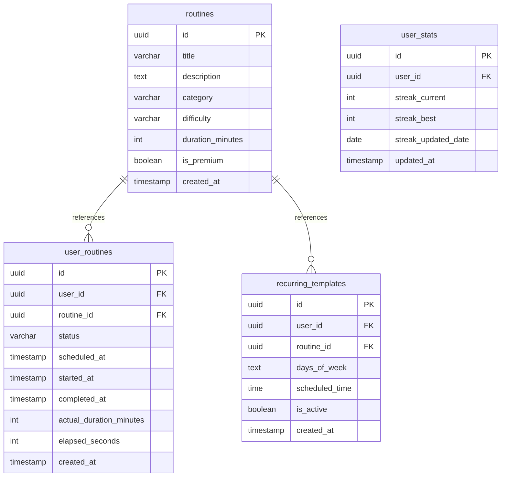
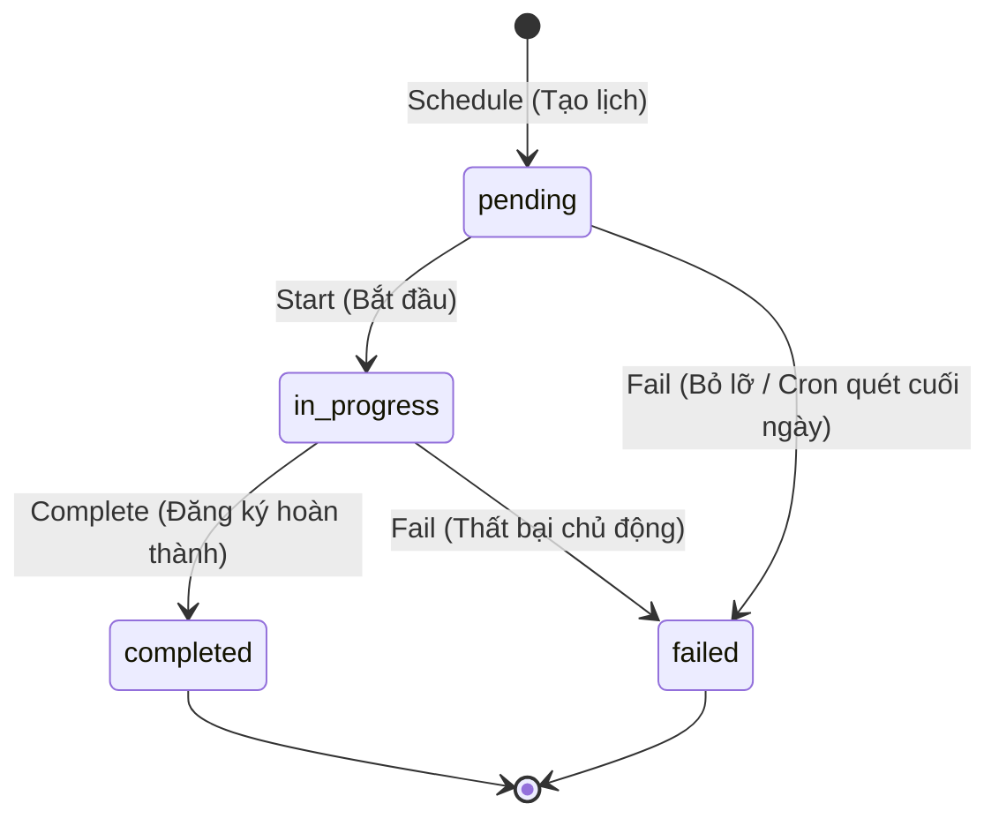

# Tài Liệu Kỹ Thuật & API - Module Routines & Gamification (HealthPath)

Tài liệu này cung cấp hướng dẫn lập trình, thiết kế kiến trúc, quy tắc nghiệp vụ hệ thống và mô tả chi tiết toàn bộ các API endpoints của **Module Routines (Quản lý thói quen)** & **Gamification (Streak)** đã được hoàn thiện trong dự án **HealthPath API**. 

Hệ thống sử dụng chuẩn phản hồi `ApiResponse<T>` nhất quán, tích hợp tác vụ ngầm tự động với **Hangfire**, và cấu hình kiểm thử trực quan thông qua công cụ **Bruno**.

---

## 1. Tổng Quan Tính Năng & Phạm Vi

Routines là module lõi của HealthPath, hỗ trợ người dùng xây dựng, duy trì và theo dõi các thói quen sức khỏe hằng ngày.

### 1.1. Phạm vi hỗ trợ (In-Scope)
- **Thư viện bài tập mẫu (Routine Library):** Cho phép Admin tạo danh mục bài tập mẫu (hệ thống) và người dùng tự định nghĩa thói quen cá nhân.
- **Lên lịch cá nhân (Scheduling):** Đăng ký thực hiện thói quen (One-time hoặc định kỳ Recurring).
- **Máy trạng thái thực thi (Execution State Machine):** Tracking trạng thái luyện tập thời gian thực (`pending` → `in_progress` → `completed` / `failed`).
- **Gamification & Streak:** Tự động tính toán số ngày duy trì thói quen liên tiếp để thúc đẩy tinh thần luyện tập của người dùng.

### 1.2. Ngoài phạm vi (Out-Of-Scope)
- *Wearable Integration:* Chưa đồng bộ trực tiếp với Apple Health / Google Fit.
- *Hệ thống điểm (Score) và Huy hiệu (Badge):* Đã được loại bỏ để tập trung vào tính năng Streak cốt lõi trong Phase này.

---

## 2. Kiến Trúc Cơ Sở Dữ Liệu (PostgreSQL Schema)

Hệ thống sử dụng 4 bảng chính trong cơ sở dữ liệu PostgreSQL để quản lý vòng đời thói quen và streak của người dùng.



### 2.1. Bảng `routines` - Thư viện thói quen mẫu
Lưu trữ danh sách bài tập tĩnh hoặc bài tập do người dùng tùy biến.
- `id` (UUID, PK): Khóa chính tự sinh.
- `title` (VARCHAR(200), NOT NULL): Tên của thói quen/bài tập.
- `description` (TEXT, NULL): Mô tả chi tiết các bước tập luyện.
- `category` (VARCHAR(50), NOT NULL): Phân loại (Ví dụ: `Stretching`, `Yoga`, `Cardio`, `Meditation`).
- `difficulty` (VARCHAR(20), NOT NULL): Mức độ khó (`easy`, `medium`, `hard`).
- `duration_minutes` (INT, NOT NULL): Thời lượng ước tính (phút).
- `is_premium` (BOOLEAN, DEFAULT FALSE): Trạng thái bản quyền. Nếu `true`, yêu cầu tài khoản Premium để đăng ký/luyện tập.
- `created_at` (TIMESTAMPTZ, NOT NULL): Thời điểm tạo.

### 2.2. Bảng `user_routines` - Lịch trình và lịch sử thực hiện
Mỗi lần người dùng lên lịch hoặc thực hiện thói quen, một bản ghi mới sẽ được tạo ra (không tái sử dụng bản ghi cũ để bảo toàn lịch sử/audit trail).
- `id` (UUID, PK): Khóa chính.
- `user_id` (UUID, FK -> Users): Định danh người dùng.
- `routine_id` (UUID, FK -> Routines): Định danh thói quen gốc.
- `status` (VARCHAR(20), NOT NULL): Trạng thái hiện tại (`pending`, `in_progress`, `completed`, `failed`).
- `scheduled_at` (TIMESTAMPTZ, NULL): Thời điểm dự kiến thực hiện thói quen.
- `started_at` (TIMESTAMPTZ, NULL): Ghi nhận khi người dùng ấn nút "Start".
- `completed_at` (TIMESTAMPTZ, NULL): Ghi nhận khi người dùng hoàn thành luyện tập.
- `actual_duration_minutes` (INT, NULL): Thời lượng thực hiện thực tế (tính bằng phút).
- `elapsed_seconds` (INT, DEFAULT 0): Số giây tập luyện trôi qua (hỗ trợ lưu vết tiến trình).

### 2.3. Bảng `user_stats` - Chỉ số Gamification
Lưu trữ tiến trình gamification của mỗi cá nhân.
- `id` (UUID, PK): Khóa chính.
- `user_id` (UUID, UNIQUE FK -> Users): Định danh người dùng.
- `streak_current` (INT, DEFAULT 0): Chuỗi ngày luyện tập liên tiếp hiện tại.
- `streak_best` (INT, DEFAULT 0): Kỷ lục chuỗi ngày liên tiếp cao nhất lịch sử.
- `streak_updated_date` (DATE, NULL): Ngày cuối cùng ghi nhận tăng streak (dùng định dạng `YYYY-MM-DD` để so khớp múi giờ).

### 2.4. Bảng `recurring_templates` - Cấu hình thói quen định kỳ
Lưu trữ thông tin để sinh lịch tự động cho thói quen lặp lại.
- `id` (UUID, PK): Khóa chính.
- `user_id` (UUID, FK -> Users): Người đăng ký.
- `routine_id` (UUID, FK -> Routines): Thói quen gốc cần lặp lại.
- `days_of_week` (TEXT, NOT NULL): Danh sách các thứ trong tuần được kích hoạt (lưu trữ dưới dạng JSON array, ví dụ: `[1, 3, 5]` tương ứng Thứ 2, Thứ 4, Thứ 6).
- `scheduled_time` (TIME, NOT NULL): Giờ thực hiện dự kiến trong ngày.
- `is_active` (BOOLEAN, DEFAULT TRUE): Trạng thái hoạt động của mẫu định kỳ.

---

## 3. Quy Tắc Nghiệp Vụ & Máy Trạng Thái (State Machine)

### 3.1. Rào cản Premium (Premium Gate Logic)
Khi người dùng lên lịch hoặc đăng ký thói quen thông qua API `POST /api/UserRoutine/schedule`:
1. Hệ thống kiểm tra xem Routine gốc có thuộc tính `is_premium == true` hay không.
2. Nếu có, thực hiện truy vấn bảng `user_subscriptions` để tìm gói subscription có trạng thái `status == 'active'` và `expires_at > UTCNow`.
3. Nếu không tìm thấy subscription hợp lệ, hệ thống từ chối tạo bản ghi thực hiện và trả về HTTP 400 Bad Request kèm mã lỗi nghiệp vụ:
   ```json
   {
     "success": false,
     "message": "Premium subscription is required for this routine",
     "data": null,
     "errorCode": "PREMIUM_REQUIRED",
     "errors": null
   }
   ```

### 3.2. Sơ đồ chuyển đổi Trạng thái thực thi

Mỗi bản ghi thói quen cá nhân (`user_routines`) bắt buộc phải tuân thủ nghiêm ngặt quy tắc máy trạng thái dưới đây. Mọi hành vi chuyển trạng thái trái phép sẽ bị hệ thống từ chối và trả về lỗi `INVALID_STATE_TRANSITION` (HTTP 400).



- **pending:** Trạng thái mặc định khi vừa tạo lịch tập hoặc được sinh tự động bởi hệ thống định kỳ.
- **in_progress:** Chuyển từ `pending` khi người dùng bấm nút bắt đầu tập luyện thực tế. Ghi nhận thời điểm `started_at = DateTime.UtcNow`.
- **completed:** Người dùng báo cáo hoàn thành bài tập thành công. Chỉ cho phép chuyển từ trạng thái `in_progress`. Ghi nhận `completed_at`, `actual_duration_minutes`, `elapsed_seconds`, và tự động kích hoạt tính năng tính Streak.
- **failed:** Thói quen bị bỏ lỡ hoặc người dùng từ bỏ. Cho phép chuyển đổi từ `pending` hoặc `in_progress`.

### 3.3. Thuật toán xử lý Streak liên tiếp (Streak Calculation)
Được kích hoạt tự động ngay sau khi chuyển một `UserRoutine` sang trạng thái `completed`. Quy trình tính toán dựa trên múi giờ UTC+7 như sau:

1. Lấy ngày hiện tại `today` theo định dạng `DateOnly` từ `DateTime.UtcNow`.
2. Truy vấn chỉ số streak của người dùng trong bảng `user_stats`:
   - **Nếu chưa tồn tại bản ghi `user_stats`:** Khởi tạo bản ghi mới với `streak_current = 1`, `streak_best = 1`, và `streak_updated_date = today`.
   - **Nếu đã tồn tại bản ghi `user_stats`:**
     - **Trường hợp `streak_updated_date == today`:** Người dùng đã hoàn thành ít nhất một thói quen khác trong ngày hôm nay. Không thực hiện cộng dồn thêm (giữ nguyên streak hiện tại để tránh gian lận hoàn thành nhiều bài trong 1 ngày).
     - **Trường hợp `streak_updated_date == yesterday` (Hôm qua):** Luyện tập liên tiếp thành công! Hệ thống cộng dồn: `streak_current++` và cập nhật `streak_updated_date = today`.
     - **Trường hợp `streak_updated_date < yesterday` (Bị ngắt quãng):** Người dùng đã bỏ lỡ ngày hôm qua. Chuỗi ngày liên tiếp bị reset: Đặt `streak_current = 1` và cập nhật `streak_updated_date = today`.
3. Kiểm tra kỷ lục: Nếu `streak_current > streak_best`, cập nhật `streak_best = streak_current`.
4. Lưu thay đổi xuống cơ sở dữ liệu.

---

## 4. Đặc Tả Các API Thư Viện Routine Mẫu (`RoutineController`)

Bộ API này hỗ trợ người dùng và ban quản trị truy cập, lọc và khởi tạo thư viện bài tập mẫu.

### 4.1. Lấy danh sách Routine mẫu (Get Routines)
Hỗ trợ tìm kiếm, phân loại bài tập và phân trang dữ liệu.
- **HTTP Method:** `GET`
- **URL Path:** `/api/Routine`
- **Xác thực:** Không yêu cầu (Public API).
- **Query Parameters:**
  - `category` (string, optional): Lọc theo nhóm bài tập (vd: `Stretching`, `Yoga`, `Cardio`).
  - `difficulty` (string, optional): Lọc theo độ khó (`easy`, `medium`, `hard`).
  - `page` (int, default = 1): Chỉ mục trang hiện tại.
  - `pageSize` (int, default = 10): Số lượng bản ghi trên một trang.

- **Phản hồi thành công (200 OK):**
  ```json
  {
    "success": true,
    "message": "Success",
    "data": {
      "items": [
        {
          "id": "8a873d0b-b4c8-4198-87d2-c65a00a764cf",
          "title": "Morning Warmup stretch",
          "description": "5 minutes of light morning stretching to kickstart your day.",
          "category": "Stretching",
          "difficulty": "easy",
          "durationMinutes": 5,
          "isPremium": false,
          "thumbnailUrl": "https://example.com/morning.jpg",
          "createdAt": "2026-05-20T12:00:00Z"
        }
      ],
      "page": 1,
      "pageSize": 10,
      "totalItems": 1,
      "totalPages": 1,
      "hasNext": false,
      "hasPrev": false
    },
    "errorCode": null,
    "errors": null
  }
  ```

### 4.2. Lấy chi tiết Routine theo ID (Get Routine By ID)
- **HTTP Method:** `GET`
- **URL Path:** `/api/Routine/{id}`
- **Xác thực:** Không yêu cầu (Public API).

- **Phản hồi thành công (200 OK):**
  ```json
  {
    "success": true,
    "message": "Success",
    "data": {
      "id": "8a873d0b-b4c8-4198-87d2-c65a00a764cf",
      "title": "Morning Warmup stretch",
      "description": "5 minutes of light morning stretching to kickstart your day.",
      "category": "Stretching",
      "difficulty": "easy",
      "durationMinutes": 5,
      "isPremium": false,
      "thumbnailUrl": "https://example.com/morning.jpg",
      "createdAt": "2026-05-20T12:00:00Z"
    },
    "errorCode": null,
    "errors": null
  }
  ```

- **Phản hồi thất bại khi không tìm thấy (404 Not Found):**
  ```json
  {
    "success": false,
    "message": "Routine not found",
    "data": null,
    "errorCode": "ROUTINE_NOT_FOUND",
    "errors": null
  }
  ```

### 4.3. Tạo mới Routine mẫu (Create Routine)
Hỗ trợ quản trị viên hoặc người dùng tạo thói quen tùy chỉnh mới.
- **HTTP Method:** `POST`
- **URL Path:** `/api/Routine`
- **Xác thực:** Đăng nhập yêu cầu (`Authorization: Bearer <token>`).
- **Request Body (JSON):**
  ```json
  {
    "title": "Evening Meditation",
    "description": "10 minutes of mindfulness breathing before bedtime.",
    "category": "Meditation",
    "difficulty": "easy",
    "durationMinutes": 10,
    "isPremium": false,
    "thumbnailUrl": "https://example.com/meditation.jpg"
  }
  ```

- **Phản hồi thành công (200 OK):**
  ```json
  {
    "success": true,
    "message": "Routine created successfully",
    "data": {
      "id": "1a2b3c4d-5e6f-7a8b-9c0d-1e2f3a4b5c6d",
      "title": "Evening Meditation",
      "description": "10 minutes of mindfulness breathing before bedtime.",
      "category": "Meditation",
      "difficulty": "easy",
      "durationMinutes": 10,
      "isPremium": false,
      "thumbnailUrl": "https://example.com/meditation.jpg",
      "createdAt": "2026-05-20T13:45:00Z"
    },
    "errorCode": null,
    "errors": null
  }
  ```

---

## 5. Đặc Tả Các API Theo Dõi & Lên Lịch (`UserRoutineController`)

Bộ API phục vụ người dùng tương tác trực tiếp với lịch cá nhân và cập nhật tiến độ tập luyện của họ. Yêu cầu đính kèm token JWT tại header (`Authorization: Bearer <token>`) cho mọi yêu cầu.

### 5.1. Đăng ký & Lên lịch Routine (Schedule Routine)
Khởi tạo một lịch tập thói quen. Áp dụng cơ chế Premium Gate.
- **HTTP Method:** `POST`
- **URL Path:** `/api/UserRoutine/schedule`
- **Request Body (JSON):**
  ```json
  {
    "routineId": "8a873d0b-b4c8-4198-87d2-c65a00a764cf",
    "scheduledAt": "2026-05-20T08:00:00Z"
  }
  ```

- **Phản hồi thành công (200 OK):**
  ```json
  {
    "success": true,
    "message": "Routine scheduled successfully",
    "data": {
      "id": "e54fe02b-3d20-4c34-aad8-fd8c8540b0c4",
      "userId": "089583df-61e8-43a4-ba70-e1601ac68709",
      "routineId": "8a873d0b-b4c8-4198-87d2-c65a00a764cf",
      "status": "pending",
      "scheduledAt": "2026-05-20T08:00:00Z",
      "startedAt": null,
      "completedAt": null,
      "actualDurationMinutes": null,
      "elapsedSeconds": 0,
      "createdAt": "2026-05-20T12:58:02.992046Z"
    },
    "errorCode": null,
    "errors": null
  }
  ```

- **Phản hồi thất bại khi tài khoản chưa kích hoạt Premium (400 Bad Request):**
  ```json
  {
    "success": false,
    "message": "Premium subscription is required for this routine",
    "data": null,
    "errorCode": "PREMIUM_REQUIRED",
    "errors": null
  }
  ```

### 5.2. Bắt đầu luyện tập (Start Routine)
Chuyển trạng thái từ `pending` sang `in_progress`.
- **HTTP Method:** `POST`
- **URL Path:** `/api/UserRoutine/{id}/start`

- **Phản hồi thành công (200 OK):**
  ```json
  {
    "success": true,
    "message": "Routine started",
    "data": {
      "id": "e54fe02b-3d20-4c34-aad8-fd8c8540b0c4",
      "userId": "089583df-61e8-43a4-ba70-e1601ac68709",
      "routineId": "8a873d0b-b4c8-4198-87d2-c65a00a764cf",
      "status": "in_progress",
      "scheduledAt": "2026-05-20T08:00:00Z",
      "startedAt": "2026-05-20T13:02:15Z",
      "completedAt": null,
      "actualDurationMinutes": null,
      "elapsedSeconds": 0,
      "createdAt": "2026-05-20T12:58:02.992046Z"
    },
    "errorCode": null,
    "errors": null
  }
  ```

- **Phản hồi thất bại khi chuyển đổi sai trạng thái (400 Bad Request):**
  ```json
  {
    "success": false,
    "message": "Only pending routines can be started",
    "data": null,
    "errorCode": "INVALID_STATE_TRANSITION",
    "errors": null
  }
  ```

### 5.3. Hoàn thành luyện tập (Complete Routine)
Đánh dấu hoàn thành bài tập, ghi nhận thời gian thực tế và tự động tính toán cập nhật streak ngày liên tiếp.
- **HTTP Method:** `POST`
- **URL Path:** `/api/UserRoutine/{id}/complete`
- **Request Body (JSON):**
  ```json
  {
    "status": "completed",
    "elapsedSeconds": 300,
    "actualDurationMinutes": 5
  }
  ```

- **Phản hồi thành công (200 OK):**
  ```json
  {
    "success": true,
    "message": "Routine completed",
    "data": {
      "id": "e54fe02b-3d20-4c34-aad8-fd8c8540b0c4",
      "userId": "089583df-61e8-43a4-ba70-e1601ac68709",
      "routineId": "8a873d0b-b4c8-4198-87d2-c65a00a764cf",
      "status": "completed",
      "scheduledAt": "2026-05-20T08:00:00Z",
      "startedAt": "2026-05-20T13:02:15Z",
      "completedAt": "2026-05-20T13:07:15Z",
      "actualDurationMinutes": 5,
      "elapsedSeconds": 300,
      "createdAt": "2026-05-20T12:58:02.992046Z"
    },
    "errorCode": null,
    "errors": null
  }
  ```

### 5.4. Đánh dấu thất bại chủ động (Fail Routine)
Người dùng chủ động từ bỏ hoặc hủy luyện tập nửa chừng.
- **HTTP Method:** `POST`
- **URL Path:** `/api/UserRoutine/{id}/fail`

- **Phản hồi thành công (200 OK):**
  ```json
  {
    "success": true,
    "message": "Routine marked as failed",
    "data": {
      "id": "e54fe02b-3d20-4c34-aad8-fd8c8540b0c4",
      "userId": "089583df-61e8-43a4-ba70-e1601ac68709",
      "routineId": "8a873d0b-b4c8-4198-87d2-c65a00a764cf",
      "status": "failed",
      "scheduledAt": "2026-05-20T08:00:00Z",
      "startedAt": "2026-05-20T13:02:15Z",
      "completedAt": null,
      "actualDurationMinutes": null,
      "elapsedSeconds": 0,
      "createdAt": "2026-05-20T12:58:02.992046Z"
    },
    "errorCode": null,
    "errors": null
  }
  ```

### 5.5. Xem lịch trình thói quen hàng ngày cá nhân (Get My Schedule)
Liệt kê và phân trang danh sách các thói quen cá nhân đã lên lịch.
- **HTTP Method:** `GET`
- **URL Path:** `/api/UserRoutine/my-schedule`
- **Query Parameters:**
  - `date` (DateTime, optional): Định dạng `YYYY-MM-DD` để lọc thói quen của ngày cụ thể. Nếu trống, trả về toàn bộ lịch trình.
  - `page` (int, default = 1): Chỉ mục trang.
  - `pageSize` (int, default = 10): Số bản ghi tối đa mỗi trang.

- **Phản hồi thành công (200 OK):**
  ```json
  {
    "success": true,
    "message": "Success",
    "data": {
      "items": [
        {
          "id": "e54fe02b-3d20-4c34-aad8-fd8c8540b0c4",
          "userId": "089583df-61e8-43a4-ba70-e1601ac68709",
          "routineId": "8a873d0b-b4c8-4198-87d2-c65a00a764cf",
          "status": "pending",
          "scheduledAt": "2026-05-20T08:00:00Z",
          "startedAt": null,
          "completedAt": null,
          "actualDurationMinutes": null,
          "elapsedSeconds": 0,
          "createdAt": "2026-05-20T12:58:02.992046Z",
          "routine": {
            "id": "8a873d0b-b4c8-4198-87d2-c65a00a764cf",
            "title": "Morning Warmup stretch",
            "category": "Stretching",
            "difficulty": "easy",
            "durationMinutes": 5,
            "isPremium": false,
            "thumbnailUrl": "https://example.com/morning.jpg"
          }
        }
      ],
      "page": 1,
      "pageSize": 10,
      "totalItems": 1,
      "totalPages": 1,
      "hasNext": false,
      "hasPrev": false
    },
    "errorCode": null,
    "errors": null
  }
  ```

### 5.6. Lấy chỉ số Streak của tôi (Get My Streak - Option 1)
API được thiết kế tách biệt và tối ưu hóa để hiển thị các chỉ số Streak trên màn hình DashBoard / Hồ sơ cá nhân của ứng dụng di động.
- **HTTP Method:** `GET`
- **URL Path:** `/api/UserRoutine/streak`

- **Phản hồi thành công (200 OK - Đã phát sinh hoạt động):**
  ```json
  {
    "success": true,
    "message": "Success",
    "data": {
      "streakCurrent": 7,
      "streakBest": 12,
      "streakUpdatedDate": "2026-05-20"
    },
    "errorCode": null,
    "errors": null
  }
  ```

- **Phản hồi thành công (200 OK - Tài khoản mới chưa hoạt động - Giá trị mặc định):**
  ```json
  {
    "success": true,
    "message": "User stats not found, returned default values",
    "data": {
      "streakCurrent": 0,
      "streakBest": 0,
      "streakUpdatedDate": null
    },
    "errorCode": null,
    "errors": null
  }
  ```

### 5.7. Đăng ký & Lên lịch thói quen định kỳ (Create Recurring Template)
Đăng ký khung giờ tự động sinh thói quen hàng tuần cho người dùng. Áp dụng cơ chế Premium Gate.
- **HTTP Method:** `POST`
- **URL Path:** `/api/UserRoutine/recurring`
- **Request Body (JSON):**
  ```json
  {
    "routineId": "8a873d0b-b4c8-4198-87d2-c65a00a764cf",
    "daysOfWeek": [1, 3, 5],
    "scheduledTime": "07:30:00"
  }
  ```

- **Phản hồi thành công (200 OK):**
  ```json
  {
    "success": true,
    "message": "Recurring template created successfully",
    "data": {
      "id": "9b1deb4d-3b7d-4bad-9bdd-2b0d7b3dcb6d",
      "userId": "089583df-61e8-43a4-ba70-e1601ac68709",
      "routineId": "8a873d0b-b4c8-4198-87d2-c65a00a764cf",
      "daysOfWeek": [1, 3, 5],
      "scheduledTime": "07:30:00",
      "isActive": true,
      "createdAt": "2026-05-20T14:20:00Z",
      "routine": {
        "id": "8a873d0b-b4c8-4198-87d2-c65a00a764cf",
        "title": "Morning Warmup stretch",
        "category": "Stretching",
        "difficulty": "easy",
        "durationMinutes": 5,
        "isPremium": false,
        "thumbnailUrl": "https://example.com/morning.jpg"
      }
    },
    "errorCode": null,
    "errors": null
  }
  ```

- **Phản hồi thất bại khi thiếu Premium (400 Bad Request):**
  ```json
  {
    "success": false,
    "message": "Premium subscription is required for this routine",
    "data": null,
    "errorCode": "PREMIUM_REQUIRED",
    "errors": null
  }
  ```

### 5.8. Lấy danh sách lịch lặp lại của tôi (Get My Recurring Templates)
- **HTTP Method:** `GET`
- **URL Path:** `/api/UserRoutine/recurring`

- **Phản hồi thành công (200 OK):**
  ```json
  {
    "success": true,
    "message": "Success",
    "data": [
      {
        "id": "9b1deb4d-3b7d-4bad-9bdd-2b0d7b3dcb6d",
        "userId": "089583df-61e8-43a4-ba70-e1601ac68709",
        "routineId": "8a873d0b-b4c8-4198-87d2-c65a00a764cf",
        "daysOfWeek": [1, 3, 5],
        "scheduledTime": "07:30:00",
        "isActive": true,
        "createdAt": "2026-05-20T14:20:00Z",
        "routine": {
          "id": "8a873d0b-b4c8-4198-87d2-c65a00a764cf",
          "title": "Morning Warmup stretch",
          "category": "Stretching",
          "difficulty": "easy",
          "durationMinutes": 5,
          "isPremium": false,
          "thumbnailUrl": "https://example.com/morning.jpg"
        }
      }
    ],
    "errorCode": null,
    "errors": null
  }
  ```

### 5.9. Hủy lịch định kỳ (Delete Recurring Template)
Thực hiện xóa mềm cấu hình thói quen định kỳ để dừng việc tự động sinh lịch tập hàng ngày.
- **HTTP Method:** `DELETE`
- **URL Path:** `/api/UserRoutine/recurring/{id}`

- **Phản hồi thành công (200 OK):**
  ```json
  {
    "success": true,
    "message": "Recurring template deleted successfully",
    "data": null,
    "errorCode": null,
    "errors": null
  }
  ```

---


## 6. Các Tác Vụ Ngầm Đồng Bộ Tự Động (Hangfire Background Jobs)

Dự án tích hợp công cụ lập lịch **Hangfire** để đảm bảo quá trình xử lý đồng bộ dữ liệu diễn ra tự động hằng ngày, quy chuẩn khớp theo múi giờ Việt Nam (UTC+7 / `SE Asia Standard Time`).

### 6.1. Tác vụ sinh thói quen định kỳ (`recurring-routines`)
- **Tần suất kích hoạt:** `0 0 * * *` (Chạy định kỳ vào đúng lúc 00:00 nửa đêm hằng ngày theo giờ UTC+7).
- **Quy trình xử lý nghiệp vụ:**
  1. Chuyển đổi mốc thời gian hệ thống hiện tại sang múi giờ UTC+7.
  2. Xác định ngày hôm nay trong tuần (Chuyển đổi kiểu `DayOfWeek` của C# sang hệ số từ `1 = Thứ 2` đến `7 = Chủ Nhật`).
  3. Truy vấn toàn bộ các bản ghi `recurring_templates` đang kích hoạt (`IsActive = true` và `DeletedAt == null`).
  4. Duyệt qua từng template và phân tích (Json Deserialize) danh sách `days_of_week`.
  5. Nếu danh sách chứa thứ của ngày hôm nay:
     - Tính toán mốc thời gian dự kiến thực hiện (`scheduled_time` kết hợp với ngày hôm nay).
     - Đổi ngược thời gian này sang định dạng chuẩn UTC.
     - Khởi tạo một bản ghi `UserRoutine` ở trạng thái `pending` với mốc thời gian đã đổi.
  6. Lưu hàng loạt (`AddRange`) vào cơ sở dữ liệu để tạo lịch thói quen sẵn sàng cho người dùng khi thức dậy.

### 6.2. Tác vụ rà soát thói quen bỏ lỡ (`miss-detection`)
Tránh trường hợp người dùng quên không cập nhật và để các thói quen tồn đọng vô thời hạn, làm sai lệch logic tính toán Streak của ngày kế tiếp.
- **Tần suất kích hoạt:** `50 23 * * *` (Chạy định kỳ vào lúc 23:50 cuối ngày theo giờ UTC+7).
- **Quy trình xử lý nghiệp vụ:**
  1. Xác định khung thời gian từ 00:00:00 đến 23:59:59 của ngày hôm nay theo múi giờ UTC+7, đổi tất cả sang định dạng UTC.
  2. Truy vấn toàn bộ các bản ghi `UserRoutine` của ngày hôm nay có trạng thái `status == 'pending'` (Chưa bắt đầu) và chưa bị xóa.
  3. Duyệt hàng loạt và cập nhật trạng thái của chúng sang **`failed`** (Thất bại / Bỏ lỡ).
  4. Lưu thay đổi xuống cơ sở dữ liệu. 

---

## 7. Hướng Dẫn Kiểm Thử Tự Động Với Bruno (API Testing)

Hệ thống cung cấp một bộ sưu tập API được cấu hình đầy đủ bằng công cụ **Bruno** đặt tại thư mục `/HealthPath-Bruno` trong mã nguồn. Bạn có thể sử dụng bộ công cụ này để kiểm thử nhanh chóng và tích hợp vào quy trình CI/CD.

### 7.1. Cấu hình môi trường kiểm thử
Tập tin `/HealthPath-Bruno/environments/Development.bru` chứa cấu hình mặc định kết nối với API local:
- `baseUrl`: `http://localhost:5048`

### 7.2. Cơ chế tự động lưu và đính kèm JWT Token
1. Khi bạn gửi request **Auth -> Login** trong Bruno:
   - Bruno sẽ tự động bắt phản hồi từ máy chủ.
   - Tập lệnh script sau phản hồi (Post-response Script) được thiết lập sẵn trong Bruno sẽ tự động trích xuất token:
     ```javascript
     if (res.status === 200 && res.body.success) {
       bru.setVar("token", res.body.data.token);
     }
     ```
2. Biến môi trường ẩn `{{token}}` sẽ lập tức được lưu vào bộ nhớ đệm của bộ sưu tập.
3. Tất cả các request yêu cầu đăng nhập tiếp theo (trong thư mục `Routines` hay `UserRoutines`) đều được thiết lập sẵn HTTP Header kế thừa từ bộ sưu tập:
   ```http
   Authorization: Bearer {{token}}
   ```
   *Người dùng không cần sao chép và dán token thủ công mỗi lần kiểm thử.*

### 7.3. Cách chạy kiểm thử nhanh thông qua Bruno CLI (CI/CD)
Để chạy kiểm thử tự động toàn bộ API mà không cần mở giao diện GUI, hãy thực hiện cài đặt và chạy lệnh sau từ dòng lệnh ở thư mục gốc dự án:
```bash
# Cài đặt công cụ Bruno CLI toàn cục
npm install -g @usebruno/cli

# Thực hiện chạy kiểm thử toàn bộ collection kèm cấu hình môi trường
bru run HealthPath-Bruno --env Development
```
Kết quả kiểm thử từng API endpoint, trạng thái phản hồi và mã kiểm tra tính hợp lệ sẽ hiển thị trực quan ngay trên terminal của bạn.
