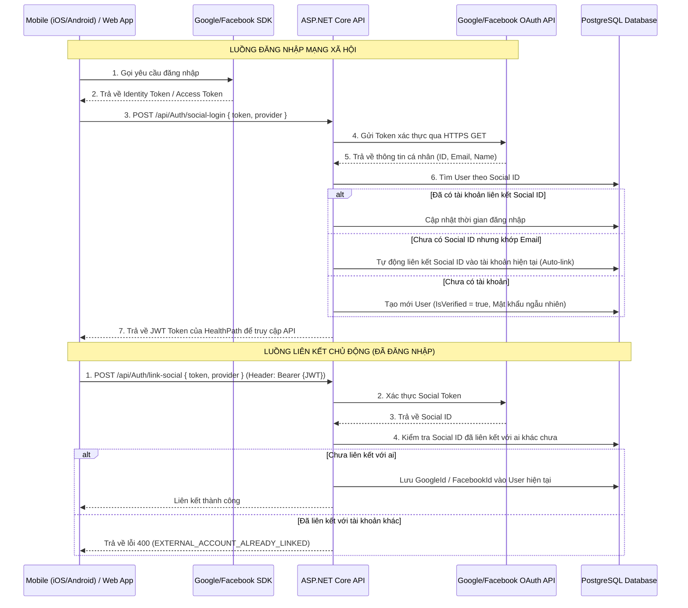

# Tài liệu Tích hợp & Cơ chế Hoạt động: Đăng nhập & Liên kết Mạng xã hội

Tài liệu này hướng dẫn cách tích hợp và vận hành hệ thống đăng nhập mạng xã hội (Google & Facebook) cũng như cơ chế liên kết tài khoản (Account Linking) trên hệ thống HealthPath.

---

## 1. Cơ chế Hoạt động (Operational Mechanism)

Hệ thống áp dụng mô hình **Client-Side Authentication & Server-Side Verification**. 

### 1.1 Sơ đồ Kiến trúc & Luồng đi dữ liệu



---

## 2. Kiến trúc Cơ sở Dữ liệu

Bảng `users` trong cơ sở dữ liệu PostgreSQL được bổ sung 2 cột mới để lưu thông tin tài khoản mạng xã hội liên kết:

*   **`google_id`** (`character varying(255)`): Lưu trữ định danh duy nhất (Claim `sub`) của tài khoản Google.
*   **`facebook_id`** (`character varying(255)`): Lưu trữ định danh duy nhất (Trường `id`) của tài khoản Facebook.

### Chỉ mục và Ràng buộc (Indexes & Constraints)
Để tối ưu hóa tốc độ tìm kiếm khi đăng nhập và ngăn ngừa một tài khoản mạng xã hội liên kết vào nhiều tài khoản khác nhau trên hệ thống, hai chỉ mục duy nhất được thiết lập kèm theo bộ lọc xóa mềm (Soft Delete):
- **`idx_users_google_id`**: `CREATE UNIQUE INDEX idx_users_google_id ON users (google_id) WHERE (google_id IS NOT NULL AND deleted_at IS NULL);`
- **`idx_users_facebook_id`**: `CREATE UNIQUE INDEX idx_users_facebook_id ON users (facebook_id) WHERE (facebook_id IS NOT NULL AND deleted_at IS NULL);`

---

## 3. Hướng dẫn Tích hợp Phía Client (Client-Side Integration)

### Bước 1: Đăng nhập SDK trên Thiết bị (Client)
Tích hợp các thư viện SDK chính thức của Google và Facebook trên Mobile/Web App của bạn:
- **Google Sign-In**: Cấu hình OAuth Client ID. Khi người dùng xác thực thành công, Client sẽ nhận được **`idToken`** (JWT được ký bởi Google). 
  *Lưu ý: Không gửi `accessToken` của Google vì nó không chứa đầy đủ thông tin định danh (OIDC). Phải gửi `idToken`.*
- **Facebook Login**: Cấu hình App ID. Khi người dùng xác thực thành công, Client nhận được **`accessToken`** từ Facebook Graph.

### Bước 2: Gửi yêu cầu lên Backend
Client thực hiện gọi API `/api/Auth/social-login` hoặc `/api/Auth/link-social` kèm theo Token vừa nhận được.

---

## 4. Đặc tả Tài liệu API (API Specifications)

### 4.1 Đăng nhập Mạng xã hội
Đăng ký hoặc đăng nhập tự động bằng tài khoản mạng xã hội.

*   **Endpoint**: `/api/Auth/social-login`
*   **Method**: `POST`
*   **Auth**: Không yêu cầu (Anonymous)
*   **Request Body**:
    ```json
    {
      "token": "string",
      "provider": "google" // "google" hoặc "facebook"
    }
    ```
*   **Response (Thành công - HTTP 200)**:
    ```json
    {
      "success": true,
      "message": "Đăng nhập mạng xã hội thành công!",
      "data": {
        "token": "eyJhbGciOiJIUzI1NiIsInR5cCI6IkpXVCJ9..."
      },
      "errors": null
    }
    ```
*   **Response (Thất bại do Token không hợp lệ - HTTP 400)**:
    ```json
    {
      "success": false,
      "message": "Xác thực tài khoản mạng xã hội thất bại hoặc mã token không hợp lệ.",
      "data": null,
      "errors": null,
      "errorCode": "INVALID_CREDENTIALS"
    }
    ```

---

### 4.2 Liên kết tài khoản chủ động
Liên kết tài khoản Google hoặc Facebook vào tài khoản hiện tại khi người dùng đang trong phiên đăng nhập.

*   **Endpoint**: `/api/Auth/link-social`
*   **Method**: `POST`
*   **Headers**:
    *   `Authorization`: `Bearer <HealthPath_JWT_Token>`
*   **Request Body**:
    ```json
    {
      "token": "string",
      "provider": "facebook" // "google" hoặc "facebook"
    }
    ```
*   **Response (Thành công - HTTP 200)**:
    ```json
    {
      "success": true,
      "message": "Liên kết tài khoản facebook thành công!",
      "data": {},
      "errors": null
    }
    ```
*   **Response (Lỗi đã bị tài khoản khác liên kết - HTTP 400)**:
    ```json
    {
      "success": false,
      "message": "Tài khoản mạng xã hội này đã được liên kết với một người dùng khác.",
      "data": null,
      "errors": null,
      "errorCode": "EXTERNAL_ACCOUNT_ALREADY_LINKED"
    }
    ```

---

### 4.3 Hủy liên kết tài khoản
Gỡ bỏ phương thức đăng nhập bằng Google hoặc Facebook ra khỏi tài khoản hiện tại.

*   **Endpoint**: `/api/Auth/unlink-social`
*   **Method**: `POST`
*   **Query Parameters**:
    *   `provider`: `"google"` hoặc `"facebook"` (Bắt buộc)
*   **Headers**:
    *   `Authorization`: `Bearer <HealthPath_JWT_Token>`
*   **Response (Thành công - HTTP 200)**:
    ```json
    {
      "success": true,
      "message": "Hủy liên kết tài khoản google thành công!",
      "data": {},
      "errors": null
    }
    ```
*   **Response (Thất bại do là phương thức đăng nhập duy nhất - HTTP 400)**:
    ```json
    {
      "success": false,
      "message": "Bạn không thể hủy liên kết phương thức đăng nhập duy nhất này của tài khoản.",
      "data": null,
      "errors": null,
      "errorCode": "FORBIDDEN"
    }
    ```

---

## 5. Hướng dẫn Kiểm thử Tiện lợi (Mock Testing Mode)

Trong quá trình phát triển (Development), việc sinh token thực tế từ Google/Facebook trên thiết bị di động có thể phức tạp. Do đó, hệ thống hỗ trợ cơ chế **Mock Token** để nhà phát triển dễ dàng kiểm thử trực tiếp trên Swagger hoặc Bruno.

### Quy tắc Mock Token trong môi trường Development:
1.  **Google**: Định dạng token bắt đầu bằng cụm `mock_google_token_` tiếp sau đó là định danh bạn muốn giả lập.
    *   Ví dụ: `"token": "mock_google_token_anhduc123"`
    *   Hệ thống sẽ giả lập thông tin nhận về từ Google:
        *   Google ID: `google_id_anhduc123`
        *   Email: `anhduc123@gmail.com`
        *   Full Name: `Google User anhduc123`
2.  **Facebook**: Định dạng token bắt đầu bằng cụm `mock_facebook_token_` tiếp sau đó là định danh bạn muốn giả lập.
    *   Ví dụ: `"token": "mock_facebook_token_testing555"`
    *   Hệ thống sẽ giả lập thông tin nhận về từ Facebook:
        *   Facebook ID: `facebook_id_testing555`
        *   Email: `testing555@facebook.com`
        *   Full Name: `Facebook User testing555`

---

## 6. Các Điểm cần Lưu ý về Bảo mật & Quy chuẩn Vận hành

1.  **HTTPS Toàn trình**: API liên kết mạng xã hội bắt buộc chỉ hoạt động qua giao thức HTTPS trong môi trường sản xuất (Production) để tránh rò rỉ mã token.
2.  **Băm mật khẩu ngẫu nhiên**: Khi một tài khoản đăng ký tự động qua mạng xã hội, hệ thống tự động băm một chuỗi `Guid` ngẫu nhiên để điền vào trường `password_hash` không được để trống của cơ sở dữ liệu. Người dùng sau đó có thể dùng chức năng "Quên mật khẩu" để đặt lại mật khẩu của riêng họ nếu muốn có thêm lựa chọn đăng nhập thủ công.
3.  **Hủy liên kết thông minh**: Hệ thống tuyệt đối chặn hành động hủy liên kết mạng xã hội nếu người dùng chưa đặt mật khẩu đăng nhập trực tiếp VÀ không liên kết với tài khoản mạng xã hội thứ hai. Điều này đảm bảo người dùng luôn có ít nhất một cách đăng nhập hợp lệ vào tài khoản.
