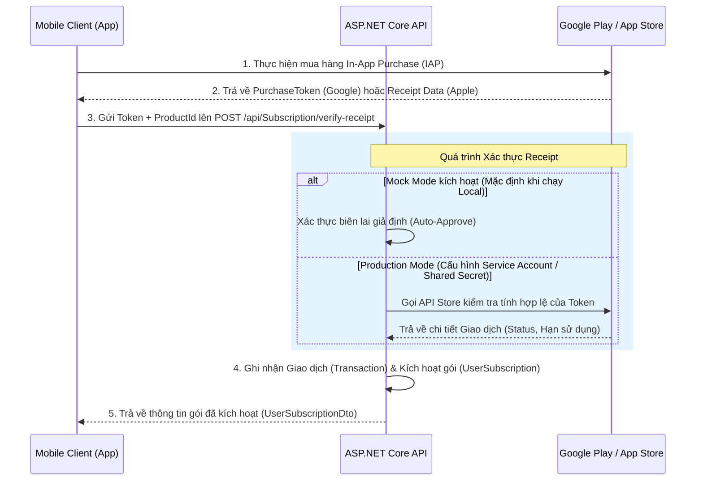

# Tài Liệu Kỹ Thuật: Module Premium Subscription & In-App Purchase (IAP) Verification

Module này đóng vai trò quản lý các gói Premium Subscription và thực hiện xác thực biên lai thanh toán (Receipt/Token Verification) từ Google Play (Android) và Apple App Store (iOS) gửi lên từ thiết bị di động (Mobile Client).

---

## 1. Cơ Chế Hoạt Động (Flow)



---

## 2. Mock Mode (Chế độ Giả lập phục vụ Phát triển Local)

Để hỗ trợ phát triển Frontend và Mobile không cần nạp tiền thật hoặc kết nối Sandbox thực tế phức tạp, hệ thống hỗ trợ **Mock Mode** qua cấu hình:
- Tệp `.env` hoặc `appsettings.json`: `"IAP:MockMode": true`

**Quy tắc Giả lập:**
- Nếu gửi `PurchaseToken` là bất kỳ chuỗi nào (ngoại trừ `fail_token`): Hệ thống tự động phê duyệt (Success), sinh Transaction ID ngẫu nhiên, tự động tạo mới/nối hạn gói Subscription của User thêm **30 ngày** (Monthly) hoặc **365 ngày** (Yearly).
- Nếu gửi `PurchaseToken` là `"fail_token"`: Hệ thống giả lập giao dịch thất bại, trả về lỗi xác thực `IAP_VERIFICATION_FAILED (7002)`.

---

## 3. Chi Tiết API Endpoints

### A. Lấy Danh Sách Gói Subscription (`GET /api/Subscription/plans`)
Lấy danh sách các gói subscription đang được kích hoạt trên hệ thống. 
Mobile App sử dụng `appleProductId` và `googleProductId` để truy vấn giá tiền hiển thị từ Store tương ứng trước khi hiển thị cho người dùng.

- **URL:** `/api/Subscription/plans`
- **Method:** `GET`
- **Authentication:** Không yêu cầu (Public)
- **Response mẫu (Success):**
```json
{
  "success": true,
  "message": "Lấy danh sách gói thành công.",
  "data": [
    {
      "id": "11111111-2222-3333-4444-555555555555",
      "name": "Gói Premium Tháng",
      "code": "premium_monthly",
      "description": "Mở khóa toàn bộ nhạc thiền, bài tập cao cấp theo tháng",
      "priceMonthly": 59000.00,
      "priceYearly": 0.00,
      "currency": "VND",
      "features": "[\"Không quảng cáo\", \"Không giới hạn audio VIP\", \"AI Companion nâng cao\"]",
      "isActive": true,
      "appleProductId": "vn.healthpath.premium.monthly",
      "googleProductId": "vn.healthpath.premium.monthly"
    }
  ],
  "errorCode": null
}
```

---

### B. Xác Thực Biên Lai & Kích Hoạt Premium (`POST /api/Subscription/verify-receipt`)
API quan trọng nhất. Được Mobile gọi ngay lập tức sau khi hoàn thành giao dịch thanh toán IAP trên App Store hoặc Google Play.

- **URL:** `/api/Subscription/verify-receipt`
- **Method:** `POST`
- **Authentication:** Bắt buộc (Bearer JWT Token)
- **Request Body mẫu (Google Play):**
```json
{
  "platform": "GooglePlay",
  "productId": "vn.healthpath.premium.monthly",
  "purchaseToken": "gplay_token_demo_123456",
  "billingCycle": "monthly"
}
```
- **Request Body mẫu (App Store):**
```json
{
  "platform": "AppStore",
  "productId": "vn.healthpath.premium.monthly",
  "purchaseToken": "appstore_jws_receipt_data_here...",
  "billingCycle": "monthly"
}
```

- **Response mẫu (Success):**
```json
{
  "success": true,
  "message": "Kích hoạt và cập nhật gói premium thành công!",
  "data": {
    "id": "673fbd46-301d-4fc9-bd46-301da02f673f",
    "userId": "99999999-8888-7777-6666-555555555555",
    "planId": "11111111-2222-3333-4444-555555555555",
    "planName": "Gói Premium Tháng",
    "status": "active",
    "billingCycle": "monthly",
    "startedAt": "2026-05-25T12:00:00Z",
    "expiresAt": "2026-06-24T12:00:00Z",
    "cancelledAt": null,
    "paymentProvider": "GooglePlay",
    "paymentRef": "gplay_tx_6234d73e1a",
    "isActiveSubscription": true
  },
  "errorCode": null
}
```

- **Response mẫu (Verification Thất bại - ví dụ truyền `fail_token`):**
```json
{
  "success": false,
  "message": "Xác thực thanh toán thất bại: Mock Verification: Invalid purchase token.",
  "data": null,
  "errorCode": "IAP_VERIFICATION_FAILED"
}
```

---

### C. Xem Trạng Thái Gói Đăng Ký Hiện Tại (`GET /api/Subscription/my-subscription`)
Xem thông tin chi tiết gói Premium đang sử dụng của tài khoản đăng nhập hiện tại.

- **URL:** `/api/Subscription/my-subscription`
- **Method:** `GET`
- **Authentication:** Bắt buộc (Bearer JWT Token)
- **Response mẫu (Có gói Premium hoạt động):**
```json
{
  "success": true,
  "message": "Lấy trạng thái gói thành công.",
  "data": {
    "id": "673fbd46-301d-4fc9-bd46-301da02f673f",
    "userId": "99999999-8888-7777-6666-555555555555",
    "planId": "11111111-2222-3333-4444-555555555555",
    "planName": "Gói Premium Tháng",
    "status": "active",
    "billingCycle": "monthly",
    "startedAt": "2026-05-25T12:00:00Z",
    "expiresAt": "2026-06-24T12:00:00Z",
    "cancelledAt": null,
    "paymentProvider": "GooglePlay",
    "paymentRef": "gplay_tx_6234d73e1a",
    "isActiveSubscription": true
  },
  "errorCode": null
}
```

- **Response mẫu (Chưa đăng ký gói nào):**
```json
{
  "success": true,
  "message": "Không có gói đăng ký hoạt động.",
  "data": null,
  "errorCode": null
}
```

---

### D. Xem Lịch Sử Giao Dịch (`GET /api/Subscription/my-transactions`)
Lấy danh sách các giao dịch mua gói Premium của tài khoản.

- **URL:** `/api/Subscription/my-transactions`
- **Method:** `GET`
- **Authentication:** Bắt buộc (Bearer JWT Token)
- **Response mẫu:**
```json
{
  "success": true,
  "message": "Lấy lịch sử giao dịch thành công.",
  "data": [
    {
      "id": "e838df89-3ae9-4dff-843e-97bb249dff84",
      "userId": "99999999-8888-7777-6666-555555555555",
      "planId": "11111111-2222-3333-4444-555555555555",
      "planName": "Gói Premium Tháng",
      "platform": "GooglePlay",
      "platformTransactionId": "gplay_tx_6234d73e1a",
      "originalTransactionId": "gplay_orig_6234d73e1a",
      "status": "Success",
      "amount": 59000.00,
      "currency": "VND",
      "purchasedAt": "2026-05-25T12:00:00Z",
      "expiresAt": "2026-06-24T12:00:00Z",
      "createdAt": "2026-05-25T12:00:05Z"
    }
  ],
  "errorCode": null
}
```

---

## 4. Server-to-Server Webhooks (Dành cho Store Callback)

Các Endpoint công khai để lắng nghe sự thay đổi trạng thái đăng ký của người dùng từ Apple và Google (gia hạn thành công, hủy gói, hoàn tiền).

### A. Google Play Real-Time Developer Notifications (RTDN)
- **URL:** `/api/webhook/google-play`
- **Method:** `POST`
- **Payload:** Nhận Pub/Sub message body chứa Base64 dữ liệu thông báo trạng thái thuê bao (`subscriptionNotification`).

### B. Apple App Store Server Notifications
- **URL:** `/api/webhook/app-store`
- **Method:** `POST`
- **Payload:** Nhận JSON payload chứa chuỗi mã hóa ký `signedPayload` chứa các sự kiện gia hạn (`DID_RENEW`), hủy bỏ (`EXPIRED`), hoàn tiền (`REVOKE`).
