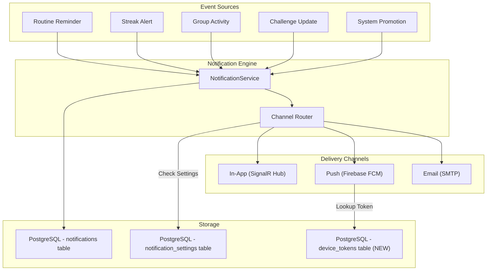
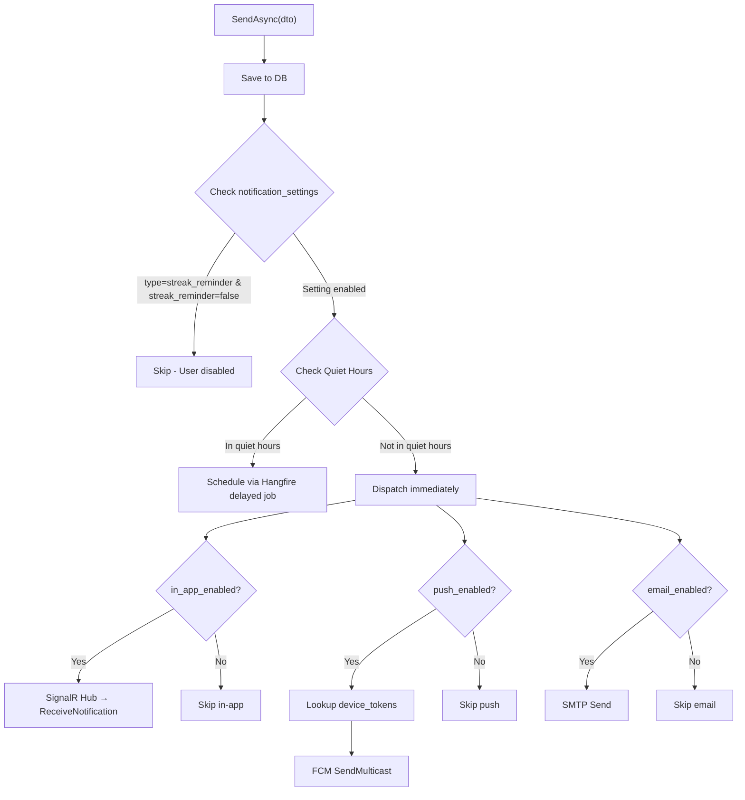
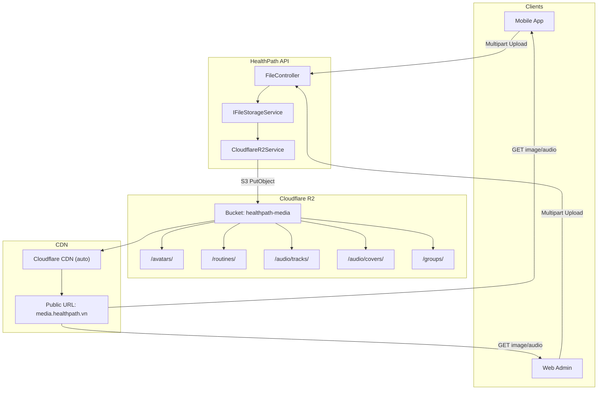
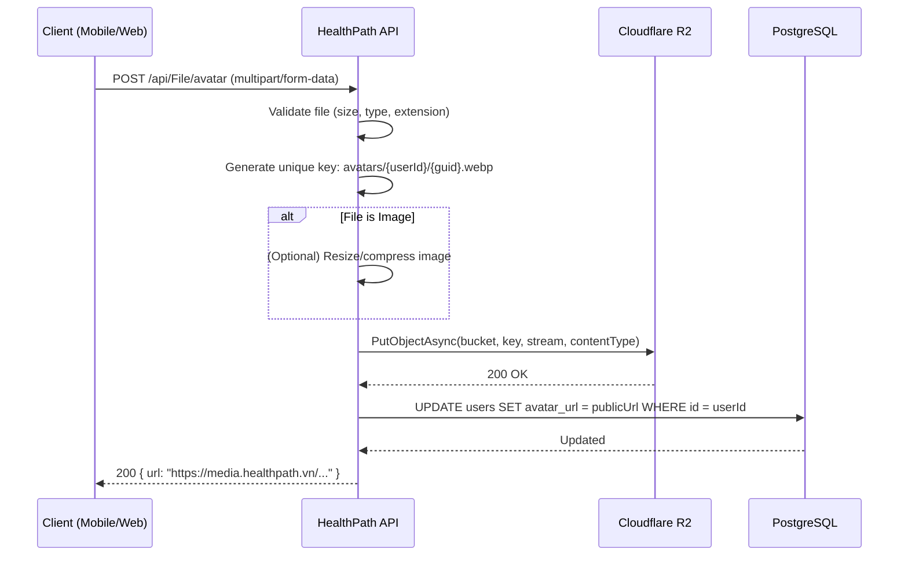

# Phân Tích & Thiết Kế Hệ Thống — Thông Báo + Lưu Trữ File (Cloudflare R2)

Tài liệu này phân tích và thiết kế kiến trúc cho **hai hệ thống lớn** cần triển khai tiếp theo trong dự án HealthPath:

1. **Hệ thống Thông báo (Notification System)** — In-App, Push (Mobile), Email
2. **Hệ thống Lưu trữ File (File Storage)** — Ảnh & Audio trên Cloudflare R2

---

## User Review Required

> [!IMPORTANT]
> **Quyết định quan trọng #1 — Chọn Provider Push Notification:**
> Thiết kế đề xuất sử dụng **Firebase Cloud Messaging (FCM)** cho cả Android lẫn iOS (thông qua APNs proxy). Nếu team muốn dùng provider khác (OneSignal, AWS SNS, ...), cần điều chỉnh lại phần Push Channel.

> [!IMPORTANT]
> **Quyết định quan trọng #2 — Cloudflare R2 Credentials:**
> Bạn cần tạo tài khoản Cloudflare, bật R2 Storage, và cung cấp các thông tin sau để tích hợp:
> - `AccountId`
> - `AccessKeyId` & `SecretAccessKey` (R2 API Token)
> - `BucketName` (ví dụ: `healthpath-media`)
> - `PublicDomain` (ví dụ: `media.healthpath.vn` — custom domain hoặc R2.dev subdomain)

> [!WARNING]
> **Real-time In-App Notification yêu cầu SignalR:**
> Khi triển khai lên production, cần cấu hình **Sticky Sessions** hoặc sử dụng **Azure SignalR Service / Redis Backplane** nếu chạy multi-instance (load balancer). Nếu chỉ chạy 1 instance thì không cần lo.

---

## Open Questions

1. **FCM Server Key:** Team đã tạo Firebase Project cho HealthPath chưa? Nếu chưa, cần tạo trước để lấy `google-services.json` (Android) và `GoogleService-Info.plist` (iOS).
2. **Email SMTP:** Dùng provider nào để gửi email? (Gmail SMTP, SendGrid, Mailgun, ...). Cần credentials (Host, Port, Username, Password).
3. **R2 Public Access:** Muốn dùng **Custom Domain** (ví dụ `media.healthpath.vn`) hay **R2.dev subdomain** miễn phí?
4. **File Size Limits:** Giới hạn dung lượng upload tối đa cho ảnh và audio là bao nhiêu? Đề xuất: ảnh ≤ 5MB, audio ≤ 50MB.
5. **Audio Format:** Chỉ hỗ trợ MP3 hay thêm WAV, FLAC, OGG?

---

# PHẦN 1: HỆ THỐNG THÔNG BÁO (NOTIFICATION SYSTEM)

## 1.1. Tổng Quan Kiến Trúc



### Luồng xử lý chính:
1. **Event phát sinh** (hoàn thành routine, cảnh báo streak, hoạt động nhóm, ...) → gọi `NotificationService.SendAsync()`
2. **NotificationService** lưu bản ghi vào bảng `notifications` trong DB
3. **Channel Router** kiểm tra `notification_settings` của user → quyết định gửi qua kênh nào
4. **Kiểm tra Quiet Hours** → nếu đang trong giờ im lặng, đưa vào Hangfire delayed queue
5. **Dispatch** qua 3 kênh song song: SignalR (real-time), FCM (push), SMTP (email)

---

## 1.2. Phân Tích Database Hiện Tại

### Bảng `notifications` (đã có trong DB)
| Cột | Kiểu | Mô tả |
|-----|------|-------|
| `id` | UUID PK | Khóa chính |
| `user_id` | UUID FK → users | Người nhận |
| `type` | VARCHAR(60) | Loại: `routine_reminder`, `streak_alert`, `group_activity`, `challenge_update`, `promotion` |
| `title` | VARCHAR(255) | Tiêu đề thông báo |
| `body` | TEXT | Nội dung chi tiết |
| `data` | JSONB | Payload bổ sung (deep link, routine_id, ...) |
| `channel` | VARCHAR(20) | Kênh gửi: `in_app`, `push`, `email` |
| `is_read` | BOOLEAN | Đã đọc chưa |
| `read_at` | TIMESTAMPTZ | Thời điểm đọc |
| `sent_at` | TIMESTAMPTZ | Thời điểm gửi |
| `deleted_at` | TIMESTAMPTZ | Soft delete |
| `created_at` | TIMESTAMPTZ | Thời điểm tạo |

### Bảng `notification_settings` (đã có trong DB)
| Cột | Kiểu | Mô tả |
|-----|------|-------|
| `id` | UUID PK | Khóa chính |
| `user_id` | UUID UNIQUE FK | 1-1 với user |
| `daily_checkin` | BOOLEAN | Nhận nhắc check-in hàng ngày |
| `streak_reminder` | BOOLEAN | Nhận cảnh báo streak |
| `group_activity` | BOOLEAN | Nhận thông báo nhóm |
| `challenge_updates` | BOOLEAN | Nhận cập nhật thử thách |
| `promotions` | BOOLEAN | Nhận khuyến mãi |
| `push_enabled` | BOOLEAN | Bật/tắt push notification |
| `email_enabled` | BOOLEAN | Bật/tắt email |
| `in_app_enabled` | BOOLEAN | Bật/tắt in-app |
| `quiet_from` | TIME | Bắt đầu giờ im lặng (mặc định 22:00) |
| `quiet_until` | TIME | Kết thúc giờ im lặng (mặc định 07:00) |

### Bảng `device_tokens` (CẦN TẠO MỚI)
Bảng này lưu FCM token của thiết bị mobile để đẩy push notification.

| Cột | Kiểu | Mô tả |
|-----|------|-------|
| `id` | UUID PK | Khóa chính |
| `user_id` | UUID FK → users | Chủ thiết bị |
| `token` | TEXT NOT NULL | FCM Registration Token |
| `platform` | VARCHAR(20) | `android` hoặc `ios` |
| `device_name` | VARCHAR(100) | Tên thiết bị (tùy chọn) |
| `is_active` | BOOLEAN | Token còn hợp lệ không |
| `created_at` | TIMESTAMPTZ | Thời điểm đăng ký |
| `updated_at` | TIMESTAMPTZ | Cập nhật gần nhất |

> **Unique constraint:** `(user_id, token)` — một thiết bị không đăng ký token trùng.

---

## 1.3. Thiết Kế Services & Interfaces

### Service Layer

```
Services/
├── INotificationService.cs          # Interface chính
├── NotificationService.cs           # Logic nghiệp vụ + Channel Router
├── Channels/
│   ├── INotificationChannel.cs      # Interface chung cho mọi kênh
│   ├── InAppChannel.cs              # SignalR Hub dispatch
│   ├── PushChannel.cs               # Firebase FCM dispatch
│   └── EmailChannel.cs              # SMTP dispatch
└── Hubs/
    └── NotificationHub.cs           # SignalR Hub cho real-time
```

### Interface chính

```csharp
public interface INotificationService
{
    // Gửi thông báo (tự động route qua các kênh phù hợp)
    Task SendAsync(SendNotificationDto dto);
    
    // Gửi hàng loạt (cho broadcast hoặc group notification)
    Task SendBulkAsync(SendBulkNotificationDto dto);
    
    // Lấy danh sách thông báo của user (có phân trang)
    Task<ApiResponse<PageResponse<NotificationDto>>> GetMyNotificationsAsync(
        Guid userId, bool? unreadOnly, int page, int pageSize);
    
    // Đánh dấu đã đọc 1 thông báo
    Task<ApiResponse<object>> MarkAsReadAsync(Guid notificationId, Guid userId);
    
    // Đánh dấu đã đọc tất cả
    Task<ApiResponse<object>> MarkAllAsReadAsync(Guid userId);
    
    // Đếm số thông báo chưa đọc
    Task<ApiResponse<UnreadCountDto>> GetUnreadCountAsync(Guid userId);
    
    // Quản lý cài đặt thông báo
    Task<ApiResponse<NotificationSettingDto>> GetSettingsAsync(Guid userId);
    Task<ApiResponse<NotificationSettingDto>> UpdateSettingsAsync(
        UpdateNotificationSettingDto dto, Guid userId);
    
    // Quản lý device token (FCM)
    Task<ApiResponse<object>> RegisterDeviceTokenAsync(RegisterDeviceTokenDto dto, Guid userId);
    Task<ApiResponse<object>> RemoveDeviceTokenAsync(string token, Guid userId);
}
```

---

## 1.4. API Endpoints

### Notification APIs

| Method | Endpoint | Mô tả | Auth |
|--------|----------|--------|------|
| `GET` | `/api/Notification` | Lấy danh sách thông báo (phân trang) | ✅ Bearer |
| `GET` | `/api/Notification/unread-count` | Đếm số thông báo chưa đọc | ✅ Bearer |
| `PUT` | `/api/Notification/{id}/read` | Đánh dấu đã đọc 1 thông báo | ✅ Bearer |
| `PUT` | `/api/Notification/read-all` | Đánh dấu đã đọc tất cả | ✅ Bearer |
| `DELETE` | `/api/Notification/{id}` | Xóa mềm 1 thông báo | ✅ Bearer |

### Notification Settings APIs

| Method | Endpoint | Mô tả | Auth |
|--------|----------|--------|------|
| `GET` | `/api/Notification/settings` | Lấy cài đặt thông báo | ✅ Bearer |
| `PUT` | `/api/Notification/settings` | Cập nhật cài đặt thông báo | ✅ Bearer |

### Device Token APIs

| Method | Endpoint | Mô tả | Auth |
|--------|----------|--------|------|
| `POST` | `/api/Notification/device-token` | Đăng ký FCM token | ✅ Bearer |
| `DELETE` | `/api/Notification/device-token` | Hủy đăng ký FCM token | ✅ Bearer |

### SignalR Hub

| Hub | Endpoint | Mô tả |
|-----|----------|--------|
| `NotificationHub` | `/hubs/notification` | Real-time notification qua WebSocket |

**Client events:**
- `ReceiveNotification(NotificationDto)` — nhận thông báo mới real-time
- `UnreadCountUpdated(int count)` — cập nhật badge count

---

## 1.5. Luồng Xử Lý Chi Tiết — Channel Router



---

## 1.6. NuGet Packages Cần Thêm (Notification)

| Package | Version | Mục đích |
|---------|---------|----------|
| `FirebaseAdmin` | latest | Firebase Admin SDK cho FCM |
| `MailKit` | latest | SMTP email client (thay cho System.Net.Mail) |

> **SignalR** đã built-in trong ASP.NET Core, không cần cài thêm package.

---

# PHẦN 2: HỆ THỐNG LƯU TRỮ FILE (CLOUDFLARE R2)

## 2.1. Tổng Quan Kiến Trúc



### Tại sao chọn Cloudflare R2?
- **Không tính phí Egress** (bandwidth ra) — tiết kiệm đáng kể so với AWS S3
- **S3-compatible API** — dùng AWS SDK for .NET trực tiếp, không cần SDK riêng
- **Tích hợp Cloudflare CDN** miễn phí — cache tự động, tốc độ truy cập nhanh toàn cầu
- **Free tier rộng rãi** — 10GB storage + 10 triệu reads + 1 triệu writes / tháng miễn phí

---

## 2.2. Cấu Trúc Thư Mục Trên R2

```
healthpath-media/                          ← Bucket name
├── avatars/
│   └── {userId}/
│       └── {guid}.{ext}                   ← User avatar (jpg, png, webp)
├── routines/
│   └── thumbnails/
│       └── {routineId}/
│           └── {guid}.{ext}               ← Routine thumbnail
├── audio/
│   ├── tracks/
│   │   └── {guid}.{ext}                   ← Audio file (mp3, wav, ogg)
│   └── covers/
│       └── {guid}.{ext}                   ← Audio cover art
├── groups/
│   └── covers/
│       └── {groupId}/
│           └── {guid}.{ext}               ← Group cover image
└── companions/
    └── avatars/
        └── {companionId}/
            └── {guid}.{ext}               ← AI Companion avatar
```

> **Lưu ý:** Tên file luôn dùng `Guid.NewGuid()` để tránh conflict và bảo mật (không lộ tên file gốc).

---

## 2.3. Mapping URL Fields Hiện Tại Trong Database

Các cột URL hiện tại trong DB đang để `NULL` hoặc chứa URL placeholder. Sau khi tích hợp R2, giá trị sẽ là URL public thực:

| Model | Field | Ví dụ URL sau tích hợp |
|-------|-------|------------------------|
| `User` | `avatar_url` | `https://media.healthpath.vn/avatars/{userId}/{guid}.webp` |
| `Routine` | `thumbnail_url` | `https://media.healthpath.vn/routines/thumbnails/{routineId}/{guid}.webp` |
| `AudioTrack` | `file_url` | `https://media.healthpath.vn/audio/tracks/{guid}.mp3` |
| `AudioTrack` | `cover_url` | `https://media.healthpath.vn/audio/covers/{guid}.webp` |
| `Group` | `cover_url` | `https://media.healthpath.vn/groups/covers/{groupId}/{guid}.webp` |
| `AiCompanion` | `avatar_url` | `https://media.healthpath.vn/companions/avatars/{companionId}/{guid}.webp` |

---

## 2.4. Thiết Kế Services & Interfaces

### Service Layer

```
Services/
├── IFileStorageService.cs         # Interface abstraction (dễ swap provider)
└── CloudflareR2Service.cs         # Implementation dùng AWS S3 SDK
```

### Interface chính

```csharp
public interface IFileStorageService
{
    /// Upload file, trả về public URL
    Task<string> UploadAsync(Stream fileStream, string fileName,
        string contentType, string folder);
    
    /// Xóa file theo key
    Task DeleteAsync(string fileKey);
    
    /// Tạo pre-signed URL cho upload trực tiếp từ client (optional)
    Task<string> GeneratePresignedUploadUrlAsync(string fileKey,
        string contentType, int expiresInMinutes = 15);
}
```

### Configuration Model

```csharp
public class CloudflareR2Options
{
    public string AccountId { get; set; } = null!;
    public string AccessKeyId { get; set; } = null!;
    public string SecretAccessKey { get; set; } = null!;
    public string BucketName { get; set; } = null!;
    public string PublicDomain { get; set; } = null!; // media.healthpath.vn
}
```

---

## 2.5. API Endpoints

### File Upload APIs

| Method | Endpoint | Mô tả | Auth | Max Size |
|--------|----------|--------|------|----------|
| `POST` | `/api/File/avatar` | Upload avatar user | ✅ Bearer | 5 MB |
| `POST` | `/api/File/routine/{routineId}/thumbnail` | Upload thumbnail routine | ✅ Bearer | 5 MB |
| `POST` | `/api/File/audio/track` | Upload audio file | ✅ Bearer | 50 MB |
| `POST` | `/api/File/audio/cover` | Upload audio cover | ✅ Bearer | 5 MB |
| `POST` | `/api/File/group/{groupId}/cover` | Upload group cover | ✅ Bearer | 5 MB |
| `DELETE` | `/api/File` | Xóa file theo URL | ✅ Bearer (Admin) | — |

### Response mẫu — Upload thành công

```json
{
  "success": true,
  "message": "File uploaded successfully",
  "data": {
    "url": "https://media.healthpath.vn/avatars/3fa85f64-5717-4562-b3fc-2c963f66afa6/a1b2c3d4.webp",
    "fileKey": "avatars/3fa85f64-5717-4562-b3fc-2c963f66afa6/a1b2c3d4.webp",
    "contentType": "image/webp",
    "sizeBytes": 245760
  }
}
```

---

## 2.6. Luồng Upload Chi Tiết



---

## 2.7. Validation Rules

### Image Upload
| Rule | Giá trị |
|------|---------|
| Max file size | 5 MB |
| Allowed MIME types | `image/jpeg`, `image/png`, `image/webp`, `image/gif` |
| Allowed extensions | `.jpg`, `.jpeg`, `.png`, `.webp`, `.gif` |

### Audio Upload
| Rule | Giá trị |
|------|---------|
| Max file size | 50 MB |
| Allowed MIME types | `audio/mpeg`, `audio/wav`, `audio/ogg`, `audio/flac` |
| Allowed extensions | `.mp3`, `.wav`, `.ogg`, `.flac` |

---

## 2.8. NuGet Package Cần Thêm (Storage)

| Package | Version | Mục đích |
|---------|---------|----------|
| `AWSSDK.S3` | latest | AWS S3 SDK — tương thích với Cloudflare R2 API |

---

## 2.9. Cấu Hình `appsettings.json`

```json
{
  "CloudflareR2": {
    "AccountId": "your-account-id",
    "AccessKeyId": "your-access-key-id",
    "SecretAccessKey": "your-secret-access-key",
    "BucketName": "healthpath-media",
    "PublicDomain": "media.healthpath.vn"
  },
  "Firebase": {
    "CredentialPath": "firebase-service-account.json"
  },
  "Smtp": {
    "Host": "smtp.gmail.com",
    "Port": 587,
    "Username": "noreply@healthpath.vn",
    "Password": "app-specific-password",
    "FromName": "HealthPath",
    "FromEmail": "noreply@healthpath.vn"
  }
}
```

---

# PHẦN 3: TỔNG HỢP THAY ĐỔI CODE

## Proposed Changes

### Component 1: Database & Models

#### [NEW] [DeviceToken.cs](file:///g:/fpt/ky%208/exe201/HealthPathEXE_BE/HealthPath.API/Models/DeviceToken.cs)
- Model mới cho bảng `device_tokens` lưu FCM registration token

#### [MODIFY] [HealthpathDbContext.cs](file:///g:/fpt/ky%208/exe201/HealthPathEXE_BE/HealthPath.API/Models/HealthpathDbContext.cs)
- Thêm `DbSet<DeviceToken>` và cấu hình Fluent API cho bảng `device_tokens`

#### [MODIFY] [User.cs](file:///g:/fpt/ky%208/exe201/HealthPathEXE_BE/HealthPath.API/Models/User.cs)
- Thêm navigation property `ICollection<DeviceToken> DeviceTokens`

---

### Component 2: DTOs

#### [NEW] NotificationDtos.cs
- `NotificationDto` — response DTO
- `SendNotificationDto` — internal DTO cho service
- `SendBulkNotificationDto` — gửi hàng loạt
- `NotificationSettingDto` — response DTO
- `UpdateNotificationSettingDto` — request DTO cập nhật settings
- `RegisterDeviceTokenDto` — request DTO đăng ký token
- `UnreadCountDto` — response DTO đếm chưa đọc

#### [NEW] FileDtos.cs
- `FileUploadResultDto` — response DTO sau upload
- `FileValidationOptions` — internal validation config

---

### Component 3: Notification Services

#### [NEW] INotificationService.cs + NotificationService.cs
- Logic nghiệp vụ chính: gửi, đọc, phân trang, cài đặt
- Channel Router tích hợp kiểm tra settings + quiet hours

#### [NEW] Channels/INotificationChannel.cs
- Interface chung: `Task SendAsync(Notification notification, User user)`

#### [NEW] Channels/InAppChannel.cs
- Dispatch qua SignalR Hub

#### [NEW] Channels/PushChannel.cs
- Dispatch qua Firebase FCM

#### [NEW] Channels/EmailChannel.cs
- Dispatch qua SMTP (MailKit)

#### [NEW] Hubs/NotificationHub.cs
- SignalR Hub cho real-time notification

---

### Component 4: File Storage Services

#### [NEW] IFileStorageService.cs + CloudflareR2Service.cs
- Upload, Delete, Generate Pre-signed URL
- Sử dụng `AWSSDK.S3` với custom endpoint trỏ vào R2

#### [NEW] Options/CloudflareR2Options.cs
- Configuration POCO cho R2 credentials

---

### Component 5: Controllers

#### [NEW] [NotificationController.cs](file:///g:/fpt/ky%208/exe201/HealthPathEXE_BE/HealthPath.API/Controllers/NotificationController.cs)
- 8 endpoints cho notification management

#### [NEW] [FileController.cs](file:///g:/fpt/ky%208/exe201/HealthPathEXE_BE/HealthPath.API/Controllers/FileController.cs)
- 6 endpoints cho file upload/delete

---

### Component 6: Configuration

#### [MODIFY] [Program.cs](file:///g:/fpt/ky%208/exe201/HealthPathEXE_BE/HealthPath.API/Program.cs)
- Đăng ký SignalR: `builder.Services.AddSignalR()`
- Đăng ký Firebase Admin SDK
- Đăng ký MailKit SMTP service
- Đăng ký Cloudflare R2 service
- Map SignalR Hub: `app.MapHub<NotificationHub>("/hubs/notification")`

#### [MODIFY] [HealthPath.API.csproj](file:///g:/fpt/ky%208/exe201/HealthPathEXE_BE/HealthPath.API/HealthPath.API.csproj)
- Thêm packages: `AWSSDK.S3`, `FirebaseAdmin`, `MailKit`

#### [MODIFY] [ErrorCode.cs](file:///g:/fpt/ky%208/exe201/HealthPathEXE_BE/HealthPath.API/Common/ErrorCode.cs)
- Thêm error codes: `NOTIFICATION_NOT_FOUND`, `FILE_TOO_LARGE`, `FILE_TYPE_NOT_ALLOWED`, `FILE_UPLOAD_FAILED`

---

### Component 7: Unit Tests

#### [NEW] NotificationServiceTests.cs
- Test gửi notification, channel routing, quiet hours, mark as read, settings CRUD

#### [NEW] CloudflareR2ServiceTests.cs
- Test upload, delete, validation, presigned URL generation

---

### Component 8: Documentation & Bruno

#### [NEW] Document/api_documentation_notification.md
- Tài liệu API đầy đủ cho Notification module

#### [NEW] Document/api_documentation_file_storage.md
- Tài liệu API đầy đủ cho File Storage module

#### [NEW] HealthPath-Bruno/Notifications/*.bru
- Bruno collection cho tất cả notification endpoints

#### [NEW] HealthPath-Bruno/FileUpload/*.bru
- Bruno collection cho tất cả file upload endpoints

---

## Verification Plan

### Automated Tests
```bash
dotnet test
```
- Kiểm tra tất cả unit tests mới + đảm bảo tests cũ không bị phá vỡ

### Manual Verification

#### Notification System
1. Chạy API local, kết nối SignalR Hub từ Postman WebSocket hoặc tool test SignalR
2. Gọi API trigger notification → xác nhận nhận được real-time qua SignalR
3. Kiểm tra notification list, mark as read, unread count
4. Test quiet hours: đặt quiet hours, gửi notification → xác nhận bị defer

#### File Storage (R2)
1. Cấu hình credentials R2 trong `appsettings.json`
2. Upload avatar qua Bruno/Swagger → xác nhận URL trả về truy cập được
3. Upload audio file → xác nhận file có thể stream/download
4. Upload file quá lớn → xác nhận trả lỗi `FILE_TOO_LARGE`
5. Upload file sai format → xác nhận trả lỗi `FILE_TYPE_NOT_ALLOWED`
