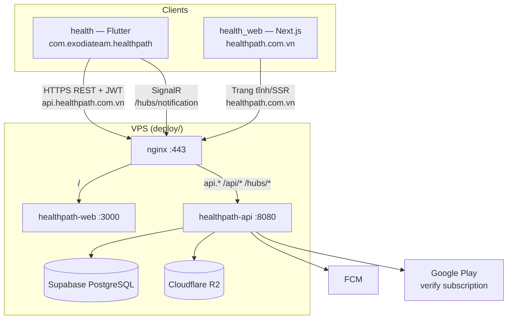
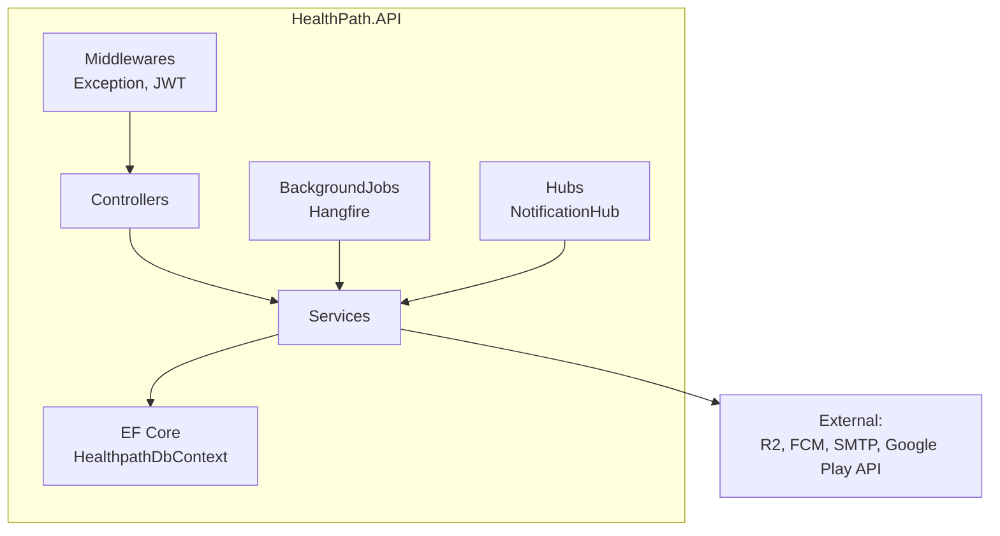
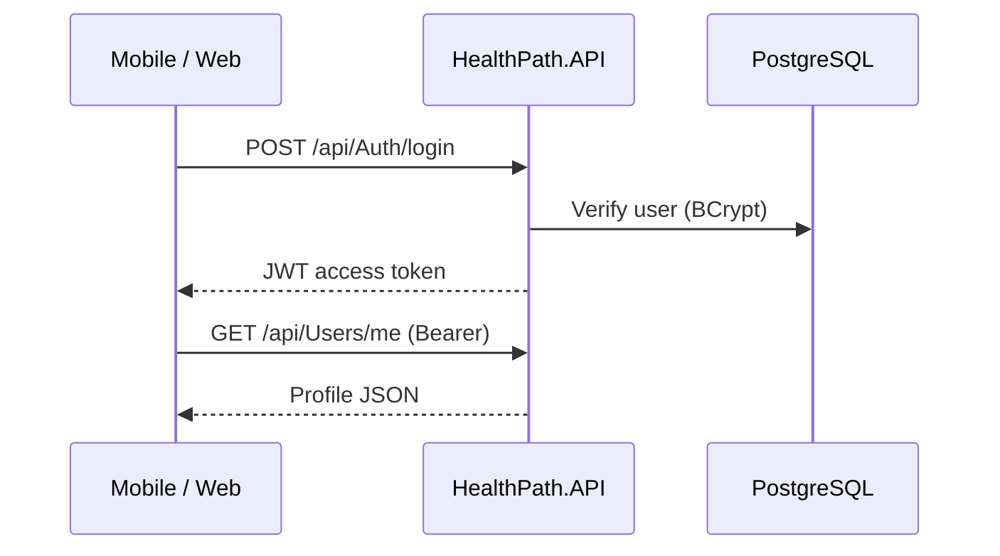
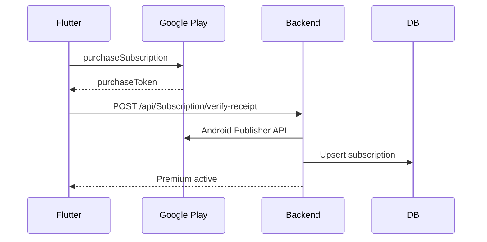
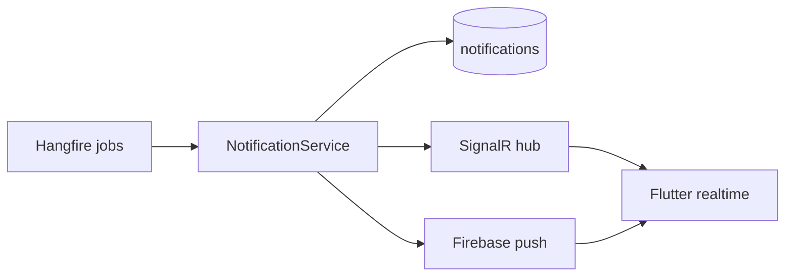

# HealthPath API (Backend)

REST API + SignalR + background jobs cho hệ sinh thái **HealthPath**: mobile Flutter (`health`), website Next.js (`health_web`), deploy Docker (`deploy`).

| | |
|---|---|
| **Stack** | ASP.NET Core 10, EF Core, PostgreSQL (Supabase) |
| **Runtime** | `net10.0` |
| **Local** | `https://localhost:7232` / `http://localhost:5048` |
| **Production** | `https://api.healthpath.com.vn` |
| **Web** | `https://healthpath.com.vn` → gọi API qua subdomain |

---

## Mục lục

1. [Chạy nhanh (ưu tiên cao nhất)](#1-chạy-nhanh-ưu-tiên-cao-nhất)
2. [Yêu cầu môi trường](#2-yêu-cầu-môi-trường)
3. [Cấu hình `.env`](#3-cấu-hình-env)
4. [Chạy local & Swagger](#4-chạy-local--swagger)
5. [Kết nối Mobile + Web](#5-kết-nối-mobile--web)
6. [Deploy production (Docker)](#6-deploy-production-docker)
7. [Giới thiệu dự án](#7-giới-thiệu-dự-án)
8. [Kiến trúc hệ thống](#8-kiến-trúc-hệ-thống)
9. [Cấu trúc solution](#9-cấu-trúc-solution)
10. [API & SignalR](#10-api--signalr)
11. [Dịch vụ tích hợp](#11-dịch-vụ-tích-hợp)
12. [Đã hoàn thành](#12-đã-hoàn-thành)
13. [Chưa hoàn thành / hạn chế](#13-chưa-hoàn-thành--hạn-chế)
14. [Tests & Bruno](#14-tests--bruno)
15. [Bảo mật & Git](#15-bảo-mật--git)

---

## 1. Chạy nhanh (ưu tiên cao nhất)

```powershell
cd D:\exe_project\health_backend\HealthPath.API

# Lần đầu: tạo .env từ mẫu
copy .env.example .env

# Sửa .env — bắt buộc: ConnectionStrings__DefaultConnection, Jwt__Key

# Chạy API
dotnet run
```

| URL | Mục đích |
|---|---|
| `https://localhost:7232/swagger` | Test API (Development) |
| `http://localhost:5048` | HTTP profile (Bruno default) |

App tự **apply EF migrations** + seed admin/routines/subscription plans khi khởi động.

**Mobile dev:** `health/.env` → `API_BASE_URL=https://10.0.2.2:7232`  
**Web dev:** `health_web/.env` → `NEXT_PUBLIC_API_URL=http://localhost:5048/api`

---

## 2. Yêu cầu môi trường

| Thành phần | Phiên bản |
|---|---|
| .NET SDK | **10.0** (`global.json` pin `10.0.300`) |
| IDE | Visual Studio 2022+ hoặc VS Code + C# Dev Kit |
| Database | PostgreSQL — **Supabase** (pooler port 5432 hoặc 6543) |
| Tùy chọn | Docker Desktop (build image deploy) |
| Tùy chọn | Bruno API Client (collection `HealthPath-Bruno/`) |

```powershell
dotnet --version   # phải 10.0.x
```

---

## 3. Cấu hình `.env`

File: `HealthPath.API/.env` (copy từ `HealthPath.API/.env.example`).

**Ưu tiên:** biến môi trường hệ thống > `.env` > `appsettings.json`

| Nhóm biến | Mô tả |
|---|---|
| `ConnectionStrings__DefaultConnection` | PostgreSQL — EF Core |
| `ConnectionStrings__HangfireConnection` | Hangfire jobs (cùng DB, session pooler) |
| `Hangfire__Enabled` | `true` / `false` |
| `Jwt__Key` | Secret ký JWT (≥ 32 ký tự) |
| `Jwt__Issuer`, `Jwt__Audience`, `Jwt__ExpireDays` | JWT metadata |
| `CloudflareR2__*` | Lưu file avatar, audio (S3-compatible) |
| `Firebase__CredentialPath` | `firebase-service-account.json` — FCM push |
| `Smtp__*` | Email OTP / thông báo |
| `IAP__MockMode` | `true` dev, `false` production + Google Play SA |
| `IAP__Google__ServiceAccountKey` | Path JSON service account Play |
| `SocialAuth__*` | Google Client IDs, Facebook App Secret |
| `DEFAULT_ADMIN_*` | Seed tài khoản admin lần đầu |

**Không commit** `.env`, service account JSON, password DB.

---

## 4. Chạy local & Swagger

### Visual Studio

1. Mở `HealthPath.slnx`
2. Set startup project: **HealthPath.API**
3. F5 (profile HTTPS)

### CLI

```powershell
cd HealthPath.API
dotnet restore
dotnet run
# hoặc
dotnet watch run
```

### Đăng nhập Swagger

1. `POST /api/Auth/login` hoặc `register` + `verify-register-otp`
2. Copy `token` từ response
3. Swagger **Authorize** → dán token (không cần prefix `Bearer`)

### Migrations thủ công (hiếm khi cần)

```powershell
cd HealthPath.API
dotnet ef database update
```

Scripts SQL bổ sung: `HealthPath.API/Scripts/`

---

## 5. Kết nối Mobile + Web

### Sơ đồ client



### URL theo môi trường

| Client | Biến cấu hình | Local | Production |
|---|---|---|---|
| **Mobile** | `API_BASE_URL` | `https://10.0.2.2:7232` | `https://api.healthpath.com.vn` |
| **Web** | `NEXT_PUBLIC_API_URL` | `http://localhost:5048/api` | `https://api.healthpath.com.vn/api` |

> Mobile: base URL **không** có `/api` suffix — client tự ghép `/api/Auth/...`  
> Web: `NEXT_PUBLIC_API_URL` **có** `/api` ở cuối (khi web gọi fetch từ browser).

### CORS

API dùng policy `AllowAll` — mobile app và web browser đều gọi được.

### Auth chung

| Luồng | Mobile | Web (nếu có trang login sau) |
|---|---|---|
| Email/password | `POST /api/Auth/login` | Cùng endpoint |
| Google | Mobile SDK → `POST /api/Auth/social-login` | — |
| Facebook | Mobile SDK → `POST /api/Auth/social-login` | — |
| JWT | Header `Authorization: Bearer {token}` | Giống nhau |

### SignalR (chỉ mobile hiện tại)

- Hub: `/hubs/notification`
- Token: query `?access_token={jwt}`
- WebSocket qua nginx (upgrade headers đã cấu hình)

### Web không qua API cho

- Privacy policy, delete-account, landing — static Next.js
- Play Store link — `NEXT_PUBLIC_PLAY_STORE_URL` (build-time)

---

## 6. Deploy production (Docker)

Backend **không build trên VPS** — build image local, upload qua `deploy/`.

```powershell
# Từ repo root
.\deploy\scripts\build-api-image.ps1
.\deploy\scripts\deploy-all.ps1
```

| Thành phần | Chi tiết |
|---|---|
| Image | `healthpath-api:prod` |
| Dockerfile | `HealthPath.API/Dockerfile` |
| Env production | `deploy/env/.env.production` (gitignored ở deploy) |
| Secrets mount | `deploy/secrets/firebase-service-account.json`, `play-service-account.json` |
| Nginx | `api.healthpath.com.vn` → container `:8080` |
| Swagger/Hangfire | **Chặn** trên production nginx |

---

## 7. Giới thiệu dự án

**HealthPath.API** là backend cho app **theo dõi thói quen & thư giãn** (không phải phần mềm y tế).

**Trách nhiệm chính:**

- Xác thực người dùng (email, Google, Facebook)
- Thói quen, mood check-in, lịch routine
- Nhóm / thử thách / check-in nhóm
- Thư viện audio + streaming URL
- Companion (pet ảo): state, shop, missions
- Subscription Google Play (verify receipt)
- Thông báo in-app + push FCM + SignalR realtime
- Admin dashboard APIs
- Lưu file (avatar, audio) trên Cloudflare R2

**Repo liên quan:**

| Folder | Vai trò |
|---|---|
| `health_backend` (repo này) | API .NET |
| `health` | Flutter mobile |
| `health_web` | Next.js marketing + legal pages |
| `deploy` | Docker Compose + nginx + scripts VPS |

---

## 8. Kiến trúc hệ thống

### 8.1 Lớp trong API



| Thư mục | Vai trò |
|---|---|
| `Controllers/` | REST endpoints (`/api/*`) |
| `Services/` | Business logic |
| `Models/` | Entities, DTOs, DbContext |
| `Extensions/` | DI, migrations, seeders, Hangfire |
| `BackgroundJobs/` | Nhắc check-in, companion decay, routine |
| `Middlewares/` | Global exception handler |
| `Options/` | Strongly-typed config sections |

### 8.2 Luồng xác thực



### 8.3 Luồng subscription



### 8.4 Luồng thông báo



---

## 9. Cấu trúc solution

```
health_backend/
├── HealthPath.slnx
├── HealthPath.API.slnx
├── global.json
├── Directory.Build.props
├── HealthPath.API/
│   ├── Controllers/          # Auth, Users, Routine, Audio, Group, Companion...
│   ├── Services/               # + Hubs/
│   ├── Models/                 # EF entities + DTOs
│   ├── Extensions/             # Migrations, seed, Hangfire
│   ├── BackgroundJobs/
│   ├── Middlewares/
│   ├── Scripts/                # SQL baseline
│   ├── Dockerfile
│   ├── appsettings.json        # Template (secret = empty)
│   ├── .env.example
│   └── Program.cs
├── HealthPath.Tests/           # xUnit + Moq
├── HealthPath-Bruno/           # API collection (Git-friendly)
└── Document/                   # API docs (markdown)
```

---

## 10. API & SignalR

Base path: `/api`

| Controller | Chức năng |
|---|---|
| `AuthController` | Register, login, OTP, social, reset password |
| `UsersController` | Profile `me` |
| `FileController` | Upload avatar |
| `RoutineController` | Catalog routines hệ thống |
| `UserRoutineController` | Lịch cá nhân, recurring, complete |
| `MoodCheckinController` | Mood/energy check-in, stats |
| `AudioTrackController` | Tracks, stream URL, favorites |
| `GroupController` | Nhóm, join, check-in |
| `GroupChallengeController` | Thử thách nhóm |
| `CompanionController` | Pet, shop, missions, room |
| `NotificationController` | Inbox, settings, device token |
| `SubscriptionController` | Plans, verify receipt, my subscription |
| `WebhookController` | Webhooks (nếu bật) |
| `Admin*Controller` | Dashboard, users, roles, subscriptions |

**SignalR:** `GET/WS /hubs/notification`

Swagger: chỉ bật khi `ASPNETCORE_ENVIRONMENT=Development`.

---

## 11. Dịch vụ tích hợp

| Dịch vụ | Dùng cho | Config |
|---|---|---|
| **Supabase PostgreSQL** | Database chính + Hangfire | `ConnectionStrings__*` |
| **Cloudflare R2** | Avatar, audio files | `CloudflareR2__*` |
| **Firebase Admin** | Push notification (FCM) | `Firebase__CredentialPath` |
| **SMTP (Gmail)** | OTP email, email notifications | `Smtp__*` |
| **Google Play Android Publisher** | Verify subscription | `IAP__Google__*` + SA JSON |
| **Google tokeninfo** | Social login Google | `SocialAuth__GoogleClientIds` |
| **Facebook Graph API** | Social login Facebook | `SocialAuth__Facebook*` |
| **Hangfire** | Scheduled jobs | `Hangfire__Enabled` |

---

## 12. Đã hoàn thành

- [x] JWT auth + refresh flow cơ bản
- [x] Email register + OTP verify
- [x] Google / Facebook social login (verify token server-side)
- [x] EF Core migrations tự động + seed admin/routines/plans
- [x] User profile, avatar upload (R2)
- [x] Routines, weekly plan, mood check-in
- [x] Audio catalog + signed stream URL + favorites
- [x] Groups, challenges, team check-in
- [x] Companion game API (state, shop, missions)
- [x] Notifications: DB + FCM + SignalR + device tokens
- [x] Google Play subscription verify (mock + real SA)
- [x] Admin APIs (users, roles, dashboard)
- [x] Docker image + deploy VPS qua `deploy/`
- [x] Production: `api.healthpath.com.vn` + SSL
- [x] CORS cho mobile & web browser
- [x] Unit tests (một phần services)

---

## 13. Chưa hoàn thành / hạn chế

| Hạng mục | Ghi chú |
|---|---|
| **Companion chat AI** | Mobile dùng mock; backend chưa có LLM endpoint |
| **Web admin UI** | Chỉ có Admin API, chưa có frontend admin riêng |
| **Apple IAP** | Có stub/mock; chưa production iOS |
| **JWT Issuer/Audience validation** | Đang `false` (dev-friendly) |
| **CORS AllowAll** | Nên thu hẹp origin production |
| **Hangfire dashboard** | Bị chặn nginx prod; chưa auth riêng |
| **Rate limiting** | Chưa có |
| **Account deletion API** | Xóa tài khoản qua email/web; chưa endpoint tự động |
| **Web gọi API** | Landing chủ yếu static; ít trang gọi API trực tiếp |
| **Email production** | Cần SMTP thật + SPF/DKIM |

---

## 14. Tests & Bruno

### Unit tests

```powershell
cd D:\exe_project\health_backend
dotnet test HealthPath.Tests/HealthPath.Tests.csproj
```

### Bruno API collection

Xem `HealthPath-Bruno/README.md` — import folder vào [Bruno](https://www.usebruno.com/), chọn environment **Development**.

---

## 15. Bảo mật & Git

### Không push (đã `.gitignore`)

| File / pattern | Lý do |
|---|---|
| `.env`, `**/.env` | DB password, JWT key, SMTP, R2 keys |
| `firebase-service-account.json` | Firebase Admin private key |
| `workspace-*.json`, `play-service-account*.json` | Google Play service account |
| `bin/`, `obj/`, `.vs/` | Build artifacts |
| `_build_out/` | Local publish output |
| `*.user`, `*.suo` | IDE personal settings |

### Nên push

- `appsettings.json` (placeholder trống)
- `.env.example`
- Toàn bộ `Controllers/`, `Services/`, migrations
- `HealthPath-Bruno/` (không chứa secret — dùng env Bruno local)
- `Dockerfile`, `Document/`

### Kiểm tra trước khi push

```powershell
cd D:\exe_project\health_backend
git status
git check-ignore -v HealthPath.API\.env HealthPath.API\workspace-*.json _build_out\
```

**Cảnh báo:** Nếu thấy `workspace-*.json` trong `git status` → **không** `git add`. File đó là Google service account key.

### Commit mẫu

```powershell
git add .
git status   # xác nhận không có .env / *.json secret
git commit -m "HealthPath API: describe backend setup and integrations"
git remote add origin <URL>
git push -u origin master
```

---

## Liên hệ & tài liệu

- Mobile setup: `../health/README.md`
- Web setup: `../health_web/README.md` (nếu có) hoặc `health_web/.env.example`
- Deploy VPS: `../deploy/`
- Bruno collection: `HealthPath-Bruno/README.md`
- Tài liệu API chi tiết: `Document/`, `doc_content.txt`

---

*Cập nhật: tháng 6/2026 — HealthPath / Exodia Team*
